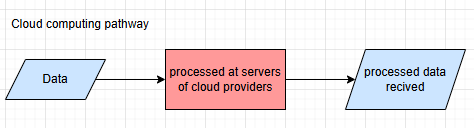
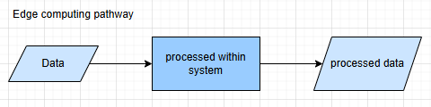

# Machine learning fundementals 

### Special terms to remeber when answering questions: 
1. Generative ai: Form of aritfical intelligence capacble of generating text, images, audio, video and other digital artefacts, usually in response to a prompt. 
2. Machine learning: Branch of AI where computers learn from data and exepirences to perform specific tasks or solve specific problem without being explicitely programmed to do so.
3. Artifical intelligence: computer technology being able to perform tasks and make decisions in a matter than imitates in a manner that imitates human intelligence. There are two main forms of AI: 
    . Narrow AI designed to perform specific tasks or solve specific types of problemn. 
    . General AI processes human-level intelligence and can operate across a range of domains.

### Differetiate between Machine Learning (ML) and Artifical intelligence (AI)
Artificial intelligence is a braod field that seeks to create systems capable of performing task that typically require human intelligence. 

This includes (but is not limited to) reasoning, learning, perception, problem-solving, understanding, and interactions. 

Machine learning is a subset of artifical intelligence that focuses on the learning aspect of AI. 
- It seeks to teach computers to learn from data, identify patterns in the data and bake decisons based on what it has learning, with minimul human intervetion. 

Implmeting machine learning programmatically is heavily reliant on the maths of stats, linear lagebra and calculus. Within machine learning, there are any further subcategories:
1. Supervised learning: linear regression, classification 
2. unsupervised learning: cultering, association rule 
3. Reinforcement learning 
4. Genetic algorithms 
5. Artificial neural networks 
6. Convolutional neural networks 

## Types of machine learning and thier applications

### Deep learning 
Deep learning means the usage of neural netowrks within a machine learning algorithm. 

A neural network structure replicates that to biological understanding of a neuron. 

Deep learning is a subset of machine learning. Deep learning is not seperate from machine learning, but is a specific approach within it (including the usage of neural networks). It utilizes layers of neural networks to extract progressively higher-level features from the input. Machine learning includes many other types of algorithms that do not require networks

### Supervised learning 
Supervised learning is an algorithm trained on labelled data sets. These data sets comprise of example input alues and the correct output resonses that should be given if the algorithm sees something resembling that input. Generally, the larger and better the data set, the more accurate the resutls that can be produced with supervised learning alogrithms. 

Supervised learning is used for regression and classification tasks: 

`Regression tasks`are where algorithms predict numerical values for the output within an allocated range. It predicts a continuous output (numerical model).

`Classification task`are where algorithms predict which category the input item belongs to. ex. an image recognizing algorithm might classify an input image as either a dog or cat.

### Unsupervised learning
An algorithm is contrusted to idenity patterns or structures within its sata sets without being provided with explicit label indicating the correct output. 

### Reinforcement learning 
Algorithms look at its input data and decide on a particular output, and is then informed how goof or bad that decision was after the fact. It uses that information to refine furture actions when presented with similar situtations. Rl is learning through trial and error. 

robotics: rl can be used to teach robots how to walk, pick up objects or perform other mechanical tasks. ex. autonomus cars use rl to better and more safely nivagate the complexities of roads and traffic. 

### Transfer leraning 
Knowledge is gained from solving one problem can be used to help solve a different but somewhat related problem can be used to help solve a differnt but somewhat related problem.
ex. 

image recognition: since the model is trained on massive data sets, transfer learning takes the model and fine tunes it for specific types of objects. The model would slready be adapted at processessing images and easily be able to identify features like edges and shapes so it wuold just need to elarn how to distinguish between the new categories. 

speech recognition:  using generalized models that have been trained on spoken language to transcribe it to text, transfer learning can be used to adapt it to work with particular accents or specialized jargon  within a particular industry. 

customized chatbots: (its not like chatgpt wrappers since you dont train it on a database) you use publicaly avalible pre=train LLaMa :llama: (Large language model meta AI), and fine tune it by training it on data to create a chatbot that can handle doman specific queries.

## Hardware requriements 
### Computing platforms 
#### Standard laptops 

`Apple: CPU and GPU M-series chip`
The Apple silion M processor that has an integrated CP, GPU and neural enginer with other componenets into a system-on=a=chip (SoC) structure for better performance and energy effeciency. With integrated cpu and gpu, the memory is also shared.

this constrasts from the traditional approch of gpu having their own dedicated memory, seperate from the RAM which are the moemry location for CPUs. 
Apples silicone-based computers are able to perform machnie learning tasks that traditional intel chips can't do without dedicated GPUs. 

`Microsoft: dedicated AI chip (NLU)`
Microsoft has been pushnig AI-focused laptops that include a spcial chip called a NPU : Neural processing unit 

A NPU is specifically designed for AI tasks, like image recognition, speech processing anf running ML models. 

Even without a pwoerful GPU in computer, NLU works alongside the CPU to run AI features locally, and be faste and more power=efficient. 

#### Dedicated workstations 
A dedicated workstation with a GPU means having a PC (physical computer) that ahs a GPU installed for example the NVIDIA RTX series. [A workstation means the machine itself, including cpu gpu and ram etc.]

A GPU allows for parallel processing capabilities which cone from thousands of processing cores optimized for parallel processing. Machine learning algorithms invovle performing the same computations on large amounts of data. GPUs can perform these same calculations on different vlaues simulataneously, wherase a CPU has to queue them up for processing commands one at a time. 

#### Edge devices 
Edge devices are those that sit at the "edge" of the network, this means `closest to where the data is created`

To compare, cloud computing has this as its pipeline: 

The data is sent to the servers of the cloud providers and the processed data is sent back. Cloud computing has high latency, whihc is the time delay beween the users action and a systems response. While edge computing devices process the data within the device itself. Another advantage edge has over cloud is that there is no issue with disoconnection or weak signals.

The pipeline for edge computing is below: 

Case study: 
`ADAS(advanced driver assistance systems) system within cars`: The data about sensors and capera input is directly processed within a small device in the car. The justification for using edge is due to the less latency of edge computing that allows for instant devision making to increase the safety. Cloud computing in this case woudl be useful for reporting of battery degradiation over time as the data can be trasfered to the batterys digital twin on cloud. processing o finfromation that does not require instant decision making is effective for cloud computing while edg computing is more effective for instintanious decision making.

Smartphones: when you sue face ID or voice typing, the processing happened within the phone itself, so the phone will be an edge deivce 

#### Cloud-basd platforms 
To perforn training on large or complex models, the use of online cloud-based platforms. Cloud platforms are acessible over the internet and proviede serivies on demand to user worldwide. 

Cloud providers allow users to vary the combination and specifications of CPUs, GPUs, and Tensor processing units TPUs, avalible for your project on demand. They can also scale to provide large quantities of RAM, storage and network connectivity based on the reqquirenments. 

The main downside ot cloud-based platforms is the dependcy and relience your projects has on external providers. You have to trusst thier data and network security and arrangement, you have to transmit you data to their network to have it perform the task for you. 

#### High-performance computing (HPC) centers
compared to publicly avalible, user-pays appraoch of cloud-based providers HPC centera are dedicated facilities designed to support large-scale scientfic or academic reaserach objecties. 

HPC is more restricted and often required membership, affiliation iwth an academic or reserach institution or specific reaserach grants or time allocation proccesses. 

They are data centres taht have been designed to be suitable for high demanding workloads that require sustained high-performace computing reasearch. They are bilt around a model of catering to reasearch-intensive tass, not an as-a-service model. 

### Processors for machine learning

`Central processing unit(CPU)`
CPUs are designed for  wide range of computing logical and arithmetic operations. CPUs are not specialized devices designed specifically for machine learning. Though they can run lesser heavy models , it is not designed for parallel processing due to the limited amount of cores. However these cores are very powerful but are limited to one task at a time, thid id goof for general task like application, os and browsing. But is very slow for larger ML tasks

`Neural processing units(NPL)` have been integrated along with traditional CPU's in consumer-level laptops. These processors are speacially designed to handle the computations required for neural networks and deep learning. This general-purpose design focuses only on ML operations. It provides faster processing time and lower powr consumption for AI-realted task by focusing on only ML math operations. 

`Graphic procesing units (GPU)`
GPUs contain hundresds to thousands of small cores designed for parallel processing such as rendering graphics (and hense the reason why soe people customize their PC's with GPU to incrase the graphics quality). GPUs are used for the parallel processing of matrix and vector operations that form the basis of neural networks.

`Tensor Processing Unit (TPU)`
Tensor processing are specifically designed for neural nnetowrks (simiarly to NPU), they focus on matrix mutiplication. These processors are desgned for tensor computing.

- Tensor is a mathematical term for an rarray with three or more dimensions
- Scalar: single number with no dimension 
- Vector: One dimensional array of numbers
- Matrix: Two dimensional array of numbers 
- Tensor: three dimesional array of numbers

The machine learning calculation values are reduced from 32-64bits to `6 bits (for example). This includes the input data values, model weights (parameters), intermediate results during computation
1. Image input: image converted to pixel values : stored as 6bit-32 
2. Inside the neural network weights and the values used or matrix multiplication : stored 32-bits (more precise) or 16-bits (less precise)

`Application-specific integrated circuits (ASICs)`
An ASIC is a chip physically built with only the circuits required for a single fixed task, removing all general-purpose functionality, which results in maximum speed and efficiency but zero flexibility. 

Due to the degree of specialization involved, ASICs tend to be more energy efficient and have lower operating costs over the long term. The downside is that the upfront cost is typically very high as the  chips require custome design adn development. This means they are really only viale where a machine learing application is going to be deplyed on a very large scale, as the per unit cost of the ASIC will decrease significantly with the scale when mass=produced. 
an example would be the Apple A-series chips used in iphones and qualcomms snapdragon. 

`Field-programmable gate arrays(FPGAs)`
FPGAs are chips you can reprogram afte building it. A FPGA is essentially a large chip of basic logic block and programmable connections between them (you are essentailly deciding how data flows). 

An FPGA is a chip made of configurable logic bloks and connections that can be programmaed after manufacturing to implement specific hardware circuits, alowing customization for tasks while retaining the ability to change them later.

ASIC --> Fixed hardware 
FPGA --> Configurable hardware 
CPU --> Fixed hardware running instructions 

# Review Questions

#### 1.  A hospital is integrating a system that can automatically diagnose diseases from patient imaging data.

##### a Describe whether this system should be classified as artificial intelligence, machine learning or deep learning.
A system to distinguish between different imaging data should be deel learning. This is due to requirement of specialized nerual networks that work with highly dimensional data such as medical imaging. Using networks will easily extract features and give predictions on the diagnosis of a patient.

#### b Distinguish between regression-based and classification-based machine learning.
Regression-based leraning models give numerical predictions, while classification-based machin learning models sort input into a label the traing data the model was trained on. 

#### 2. An email client uses a program to sort incoming emails into "Primary", "Social", "Promotions" and "Spam" folders.

#### a Identify whether this is an example of supervised or unsupervised learning.
A model that sorts incoming email into specific labels would be an example of supervised learning. 

#### b Describe your reasoning for this choice.
The email client would need to label his input data into the catogeries 'primary', 'social', 'promotional' and 'spam', so unseen and new emails can classified into the categories by the model. 

#### 3. An autonomous vehicle company transfers the knowledge from a model trained in one city to a new model designed to navigate another city.

#### a Define "transfer learning".
Transfer learning is the transfer of a model that is to be resused within a domain that is related to the original model.

#### b Outline how this is an example of transfer learning.
The autonomous vehicle comapny is reusing the navigation model of one city to produce a new model for another specific, however the navigation system logistics will reamin, only applied in a new city.

#### c Outline one possible limitation to the effectiveness of this approach.
The original model was was to an extent trained based on the conditions of the city, this includes the traffic density, driving culture, traffic rules, this difference may reduce the effectiveness of transfer learning, requirng more fine tuning of the model.

#### d The original model was trained from thousands of hours of driving on roads under human supervision to monitor and correct it when required. Describe the form of machine learning used for the original model.
The original model would be Reinforced learning if it was trained under human supervision to monitor and correct it. 

#### 4. A tech start-up is planning to deploy a large-scale machine learning system to predict stock prices in real time.

#### a Identify one type of hardware that would be critical for processing large volumes of real-time data in this context.
One type of hardware that be required to a learning system that predicts the stock prises in real price would be a graphic processing Unit (GPU).

#### b Outline one reason that this type of hardware is suitable for real-time data processing in machine learning applications.
The graphic processing unit (GPU) would be suitable due to prallel processing that is able to handle large amounts of data and computation quickly.

#### c Discuss one potential limitation of the identified hardware when used for machine learning.
The price of GPU's may be a limitation, for larger data sets, the number of GPU's required may increase, especially for real-time data processing.

#### 5. A university plans to implement an AI-driven system to analyse video lectures for enhancing online learning experiences.

#### a Identify two types of hardware that could be used for conducting machine learning processing of video data in real time.
Graphic processing Unit (GPU), Tensor processing Unit (TPU)

#### b For the two types of hardware identified, outline one possible reason for selecting each device over the other.
Tensor processing unit are specialized in matrix operations and specifically optimized for deep learning tasks, it offers high efficiency and speed for large-scale netural netowrk computations. 

Gpu;s are more widely avalible and compatible with diverse machine learning frameworks.

