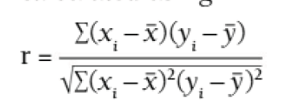
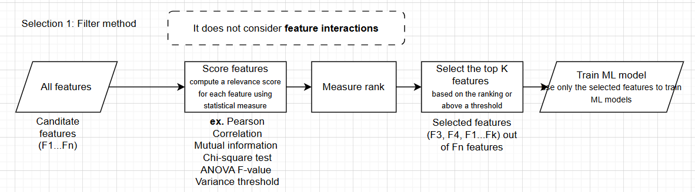
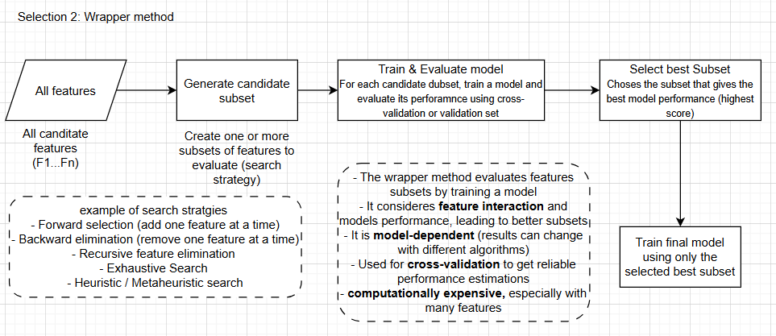
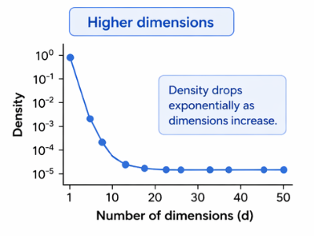
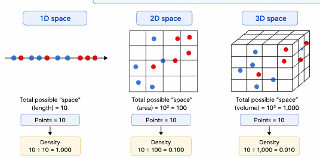

# Data Preprocessing 
## Data Cleaning 
High-quality data builds high-quality models. If the training data is full of errors or redundant features, teh model will learn from these `inaccuracies` and make `poor predictions`. Garbage In - Garbage Out (GIGO)


### Steps for cleaning data sets
1. #### Handling Outliers (Outlier handling): 

*Outlier: a data point that deviates from the typical pattern of values in a data set, indicating a possible unusual or erroneous values that should be discounted*

This is a statistical methods such as using the IQ range or Z-scores can detect outlying data. Once found, depending on the context, outlying data may be capped, transformed or removed as appropriate. 

python code:
```python 
import numpy as np 
# create random array of values between 0 and 100
# Set one extreme value to act as an outlier 

data = np.random.randint(0,100, size=1000) # size of the array is 1000, and the possible values are between 0 and 100
data[999]=937

# calcualte outlier via z-scores 
mean_one = np.mean(data)
std_dev = np.std(data)
z_scores = (data - mean)/std_dev
threshold = 3 # Outliers if 3 standard devatiation from the mean 
outliers = data [np.abs(z_scored)>threshold]
print("mean", mean, "standard deviation", std_Dev)
print("Outliers:", outliers)

# Calculate outliers via IQR
q1 = np.percentile(data, 25)
q3 = np.percentile(data, 75)
iqr = q3-q1

cutoff = 1.5*iqr
lower_bound= q1 - cutoff 
upper_bound = q3 + cutoff
outliers = data[(data<lowerbound | data > upper_bound )] # | is OR opperator, since the value output are not boolean you cant use OR here
print("Outliers:", outliers)

```
2. #### Remove duplicate data
Identifying data that is duplicates and removing them will assist in preventing the model from becoming `biased towards over-represented values` 

For data sets where individual records contain a large number of variables, calculating and comparing, SHA-256 (Secure Hash algorithm 256-bit) can be useful for detecting duplicates. 

*A cryptographic hash is mathematicla algorithm that transforms any size input data into a fixed-lenght into a `alphanumeric string`(sequence of characters containing only characters and numbers), acting as a unique digit fingerprint or signature*

Depending on the context, of the model, near duplicate data may also need to be consolidated into a single record. 


3. #### Identifying incorrect data 
Process your data through `validation rules (correctness/resonableness, quality filter, logical sense)` to ensure obviously incorrect data can be found and removed. This may mean checking the ranges given for dates and times, or amounts given for currency values, and so on. Set sensible limits and have your program detect anomalies for possible manual checking.

4. #### Filtering irrelevant data
If there is no measurable correlelation between the input variable(feature) and outcome variables, there is irrelevant to keep those input variables. Hence filtering out such data in the training process can increase efficiency, accuracy and making the model more lightweight.

5. #### Transform improperly formatted data:
(Data constraint) Data may be incorrectly formatted but rectified to ensure consistency in what is presented to the ML model. 
- Ensure all dates are in a consistent sylte (not having dd/mm/yyyy, mm/dd/yyyy mixed up)
- Ensure numerical calues are formatted, and to the same level of precision (using int and float)
- ENsure images are in the correct orientation and rotation, and of matching ratio and size 

6. #### Missing data
The usage of models to predict missing values (that may have not been collected during data collection or avalible online) to ensure full coverage of the data set. Mean / Mode imputation, k-nearest neightbors or regression models could be used for this if needed. 


7. #### Normalization and Standardization
Machine learning algorithms benefit from completing preprocessing of data by performing the operations of normalization and standardization to scale data to a standard range or distribution. (Reshaping to a specific range or distribution)

- Normalization can be used to rescale input data to a range fo [0,1] or [-1,1], `which is useful when various features (input varaibles) have different scales`

- Standardization can be used to transform the input data to have a mean score of 0 and standard deviation of 1 `(Gaussian distribution)`. 

*Note: it is not mathematically possible for the range to be [-1, 1] AND have a standard deviation of 1, you need to determine which is required for the model*

```python 
import numpy as np 
data = np.array([10, 20, 30, 40, 50])


# Normalize the data to have a mean of 0, and have a range of [-1, 1]
data_mean_centered = data - np.mean(data) # by substracting each values in the dataset by the mean, this centers, the data around 0 (so the new mean will be 0). 
# so the output for data_mean_centered would be in the calculations provided below  


max_abs_val=np.max(np.abs(data_mean_centered))
# Find the largest absolute value in the mean-centered data 
# in the data_mean_centered it would 20 [-20, -10, 0, 10, 20]


normqlized_data = data_mean_centered / max_abs_val 
# Divide each element by the maximum absolute value 
# This will scale the data from data_mean_centered into to -1 and 1 
# The result is [-1.0, -0.5, 0.0, 0.5, 1.0]


#Standardize 
standardized_data = (data - np.mean(data)) / np.std(data) #np.std calculates the standard deviation
#Standardization rescales the data so it has: 1. Mean of 0, standard deviation = 1 
#formula : X - mean / std 
# For this dataset, the standardized values are : [-1.414, -0.707, 0.0, 0.707, 1.414]
```

Normalization: Rescales the values to a `fixed range`, above it is [-1,1]


Standardization: Rescale values based on statistics (mean, standard deviation)


## Feature selection
Feature selection refers to selecting only the most relevant features for use in your machine learning models. 

*A feature is a variable that you wish to use as an input value for generating predictions. It is a numerical property that can be used to contribute a data point for a machine learning algorithm to train on.*

When removing irrelevant details, it results in a more generalized model that is better suited for processing new, previously unseen data. 

The methods are: filter methods, wrapper methods, and embedded methods.

### Filter method
- Statistical metric to determine which features are best to be retained and which should be removed from the model. 
- Feature are ranked by thier score, and those that don't meet the threshold can be filtered out

Pros: Filtering out the feature with the method is less computationally expensive that retaining the feature. 

Cons: The filter method does not detect interfeature interactions, in a sense, if one feature is affecting another, then a filter may suggest deleting a feature that is actually imporant. This is where manual appreciation of the context in the model is important. 

The most common, and easy-to-use, filter is to calculate the `r value` of the correlation (pearsons product moment correlation coefficient). The r value of data set ay be calcualted using : 

when x1 and y1 are your individual data points point notx and not y are the mean of each data series. Once calcualted, reacords with r values beyond a given threshold can be flagged for deletion. 


### Wrapper methods 
The wrapper method involves interating over different combinations of the input features and comparing which subset produces optimal performace. 

pros: This is an efficient final model at the end fo process. 

cons: This is a time-consuming and computationally expensive process, especially when compared to the filter methods. There is also an increases risk of [overfitting](#key-words) the model 



Wrapper method works well for finding combinations between features, as it considered feature-interactions

### Embedded method 
Embedded methoths draw on the both filter and wrapper methods, but incoperates thme into the model training algorithm. This means that the *feature selection is simultaneously with model training*, rather than seperate steps before training. 

Embedded methods can be more computationally efficient since they don't require seperate iteration of the data prior to training. An embedded metho will authomaically assess the relevance or imporantce of features and *adjust thier weights or inclusion* in the model accordigly during the training process.

cons : While embedded methods can save manual labour by eliminating the need for features selection processes prior to training, they typically require mor ecomputational time to simpler filter methods. 


The effectiveness of embedded methods depend on the models ability to accurately assess feature relevance during the training process. 


### Feature selection methods: 
| category | Filter | Wrapper | Embedded |
|:-----------|:------------:|:------------:|------------:|
| Computational expensive| less, its less computationally expensive than retaining all features during training | yes, interating over different combinationsof features and comparing which subset produces the optimal performnce| less, the training process is combined with the feature selection, rather than a seperate step before training|
|stage taken place| Before training| Before training| During training|


| D          | E            | E            | F           |


| D          | E            | E            | F           |


| D          | E            | E            | F           |


| D          | E            | E            | F           |


## Dimensionality Reduction

Machine learning algorithms are better when they can make generalizations about their training data. 

- Here `generalizing` means: learning patterns from training data and applying them correctly to new and unseen data(model making general patterns based on training data). 

So, its the difference between memorizing patterns vs understanding the relationships between patterns. `[Memorizing vs Generalizing]`


#### Curse of dimensionality: 
Each feature of adds another dimension to the model. The algorithm maps this feature and attemps to produce generalizations about it. The curse of dimensionality refers to when there are too many features in respective to the quantity of training data, making it harder to observe and generalize meaningful patterns.  


Number of dimensions is equal to the number of features per data point. 
- For 1D: there is only one value for each data point, this data point can be plot on a line (x)
- For 2D: there are two values for each data point, so it can be plot on a plane(grid) (x,y)
- For 3D: there are three values for each data point, so it can be plot in a 3D space (x,y,z) 
- For nD: there are n values for each data point: so the data points are plotted in a nD space(x, y, z....,n). This is possible if each data point has n number of features.


The issue with using 2d and 3d spaces compared to 1d spaces is that if the data point are kept constant, the amount of space taken increases, increasing the data sparcity.

#### The issue when data is sparce
- Data sparce means the data is spread very thinly in high dimensions

1. When data point are far apart due to sparcity, 
- There aren't enough nearly examples for the model to learn from 
- The model can't reliably estimate relationships

All of these make learning patterns harder and the model less effective

The density refers to the data density: 


`as the dimensions increase, the same amount of data occupies a tiny fraction of the avalible space that increased due to the amount of dimensions`

2. Distance stops being reliable 
Many algorithms rely on distance between points (like k-nn, k-clustering)
In high dimensions, all points becomes almost equally apart, the K-nearest neighbors, isint near anymore

3. Overfitting becomes very liekly 
Sparce data means: lots of emmpty space, easy for model to draw wierd, overly complex boundaries

The model starts memorizing noise instead of learning patterns. This leads to noise, which means random or irrelevant variations in the data that does not reflect the true underlying patterns the model is trying to learn. 

`with the same data, increasing the dimensions increases the space: harder for the model to learn and idenitfy patterns. 

### note: goals of dimensionality reduction 
Dimensioanlity reduction does not always lead to better model performance. The primary goal of dimensional reduction is to reduce the number of variables, this can sometimes lead to the loss of information such as inter-technqiue relations etc.

### Reducing dimensions of existing data sets
There are two ways to approach this: you can make the decision about the specific dimensions to reduce manaully, or make use of statistical tools to assist in the process. 

The statistical tools are: PCA (principle component analysis) and LDA (linear discriminant analysis). PCA is used for dimensional reduction without considereing your data set labels. Its good for data compression, visualization and speeding up learnging algorithms by reducing the number of input variables.

- Principle component analysis: Finds the directions where data varies the most. It dosent care about the classes (lables), it simply looks at the spread of data.

- Linear Discriminant analysis: Finds the directions that seperate classes best. It uses labels (supervised ML) and focuses on class seperation. It aims to: maximize distance between classes, and minimize spread within each class.

| Feature      | PCA                        | LDA                       |
| ------------ | -------------------------- | ------------------------- |
| Uses labels? | ❌ No                       | ✅ Yes                     |
| Goal         | Maximize variance          | Maximize class separation |
| Type         | Unsupervised               | Supervised                |
| Best for     | Compression, visualization | Classification            |


PCA keeps the most information, while LDA keeps the most seperation


# Class Notes Data preprocessing 
objectives of this chapter: 
1. Describe the significance of data clearning 
2. Describe the role of feature selection 
3. Describe the  imporantance of dimensionality reduction 

Garbidge in - Garbage out 

### Data cleaning 
High quality data builds hihg quality models. Its the principle of `Garbage in - Garbage out (GIGO)`. Cleaned data improves the reliability and accuracy of the output the model produced.

Proposessing: cleaning and processing of input

The steps of cleaning data sets: 


Low quality data: Errors, bias, missing values --> Innacuracies of biased models --> Poor predictions and unfair decisions (innaporipraite output: wrong outcome, inaccurate output: not close to required output)

`Problem 1: missing data(gaps in data sets)` 
Technqiue 1: remove the eniter rows
pros: simple
cons: potentially lose other potentially valuable information in that row

tehnqiue 2: imputation: fill the gap with a calcualted values ( ex. mean, median, or mode of the column), default values : Must be calcualted value or some justification for it 
Pros: retain rows (you dont loose row data)
cons: educated guess and not real data

`problem 2: errors and outliers`
Typo and inconsistent formats: ex. "New york", "NY", "newyork" : standardization 
solution: standardize the data and create validation routines 

Outliers: Extreme values that dont fit the pattern
solution: investigate: is it a typo or real (but rare) vlue? may need to be corrected or removed? 

`problem 3: scaling`
features are on different scales. Models can be biased towards featured with larger scales 
- If a values is scaled with a larg er range of values, the model would be biased towards the inaccuratly scaled range compared toa  feature that is correctly scaled, leading to unreliable values 

solution 1: Normalisation: rescale the values to range of [0, 1] 
solution 2: standardardozation: rescale the data to have a mean of 0 and a standard deviation of 1

`standardization: Z-score scaling` is is rescaling data so that they have a mean with a value 0, and a standard deviation equal to 1.  

`Normalization: 

Cleaning data --> Feature selection (specific)
1.  Less features
- Reduces overfitting: too many irrelevant features can confuse the mode, making it learn noise instead of the true signal :  Innaproriate valyes lead to noise 
- improves accuracy: removes noisy features can lead to better-perfomring models
- reducing training time: feawer features mean the model trains faster  
- Execution time decrease: less heavy model 

strategy 1 : Filter methods
features are selected before the trainnig process ( only imporant features that are relevant)

statsitcal tests are used to score each feature, the features taht dont meet a cetain score are filtered out. 


strategy 2: Wrapper theods
uses machine learning models itself to se lect the best combination of features : setting a threshold value that a feature reaches for the feature to be considered

it wraps the model, training and testing it on different subsets of features to find the combinations that result in the best performance 

selection 3: Embedded methdos
feature selection process is trained into the model training process itslef 

certain types of mode (lasso regression) assign a weight to each feature as they learn, unimporant weights are given a weight of zero and are effectively removed


exam syllabus: A4.1, and A4.2 
Full OOP

Dimentionality reduction:

Dimensionality reduction is simplifying data by reducing the number of features while keeping the impornat structure and pattern.

# Review Questions:

Note: Real-world data is not always ideal as in theory especially if taken from large data samples. The data is suseptable to being incomplete, noisy, inconsistent and may contian error or ourtlier.


#### 1. A marketing firm uses machine learning to analyse customer survey data to improve targeting strategies.

Features of customer surveys: 
- Large data on different questions 
- Large sample size of customers answering 

It is unlikely possible for all responses to be formatted the same

##### a. Describe one common issue in survey data that would necessitate data cleaning.
An issue with survey data that would require data cleaning comes from the properties of having large samples sizes of responses, this means not every response may be similar in format, leading to inconsistences. These answer inconsistences would necessitate data cleaning before trainig the model.


##### b. Describe how feature selection could impact the performance of a machine learning model in this scenario.
Survey's ask a large varaiety of questions, in this context, there would be lots of features that would be usefull for marketing firm to derive insights from. However, this also means, there would be lots of features that may not be required to train the model, and possible reduce the models efficiency. 


##### c. Outline the role of dimensionality reduction in handling high-dimensional data such as survey responses.
The role of dimensionlity reduction in handling high-dimensional data such as the survey responses comes from the large input volumes. With large amount of features, it becomes difficult to derive meaningful patterns as the data becomes highly dimensional. Dimensionality reduction here can reduce dimensions to simplify data while keeping the key patterns. 


#### 2. A financial analytics firm uses machine learning to predict stock-market trends based on historical data.

Features of historical data:
- Large amounts of data
- Formats may differ based on changes made in the past compared to the current changes of the present
- Human errors 

##### a. List one common data-quality issue that might require cleaning in this historical stock data.
Historical stock data has the property of change, that would be 


##### b. Describe the role of feature selection in improving model performance in financial predictions.
The role of feature selection for financial predictions can benefit the model to handle features that may not benefit the model's efficiency. Extra features may confused the model, so selecting features will results in meaningful pattern estimation. 


##### c. Describe the importance of dimensionality reduction on model complexity and performance.
The importance dimensionality reduction on model complexity and perfomance is based on the number of features. The number of features increases the number of dimensions, too many features means a more complex model making it harder to train and easier to overfit. Reducing the dimensions makes the model simpler and easier to derive meaning patterns. 


#### 3. A school district analyses standardized test results to predict student performance and identify at-risk students.

standardized test results:
- Dependent on students

##### a. List one common data issue that might arise with standardized test-result data.


##### b. Describe the possible implications if the school district was to import raw test data for all questions completed by students into the machine learning model.


##### c. Outline two commonly used methods of feature selection that could be beneficial in this educational context.
Common feature selection include the feature method to statistically rank the most optimal feature for feature generalizaing, the other would be the wrapper method that determines combinations of features that produce the most optimal generalizations. Both of them would be benefitical in the educational context to derive meaningful generalization and predictions based on student performance. 

# Key words
1. ### `Overfitting`:
When models learn the trainging data too well, including the noise, random quirks, instead of learning the true underlying patterns. An overfit model memorizes he training set and performs poorly on unseen data. [Low training error + high test error = overfitting]
- Model is too complex(too many parameters, deep trees, large neural networks)
- The dataset is too small
- There is too much noise in the data 
- Training runs too long with regularization

2. `Underfitting`:

3. ### `Data Sparcity`: 
How spread out data points are from each other in a model

4. ### `Generlize`:
Happens after training, its regards to whether the model can apply what it learned to new and unseen data

5. ### `Estimate`:
Used during the learing phase. 'what is the relationship in the data'. 

6. ### `noise`: 
Random or irrelevant variation in your data that does not reflect the true underlying pattern you're trying to learn from data. (This misleads the model)

7. ### `Sparce data`: 
Too much space (more dimensions) with not enough informations. 