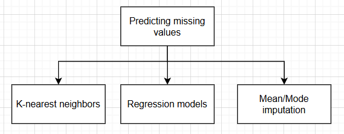
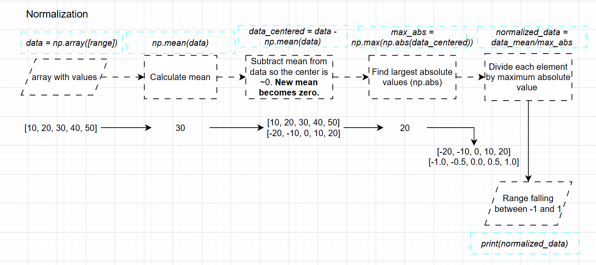
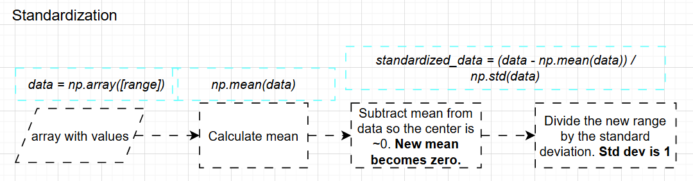
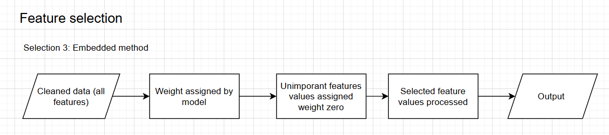

# Data Preprocessing 
## Data Cleaning 
High-quality data builds high-quality models. If the training data is full of errors or redundant features, teh model will learn from these `inaccuracies` and make `poor predictions`. Garbage In - Garbage Out (GIGO)


### Steps for cleaning data sets
1. #### Handling Outliers (Outlier handling): 

*Outlier: a data point that deviates from the typical pattern of values in a data set, indicating a possible unusual or erroneous values that should be discounted*

This is a statistical methods such as using the IQ range or Z-scores can detect outlying data. Once found, depending on the context, outlying data may be capped, transformed or removed as appropriate. 

python code:
```python 
import numpy as np 
# create random array of values between 0 and 100
# Set one extreme value to act as an outlier 

data = np.random.randint(0,100, size=1000) # size of the array is 1000, and the possible values are between 0 and 100
data[999]=937

# calcualte outlier via z-scores 
mean_one = np.mean(data)
std_dev = np.std(data)
z_scores = (data - mean)/std_dev
threshold = 3 # Outliers if 3 standard devatiation from the mean 
outliers = data [np.abs(z_scored)>threshold]
print("mean", mean, "standard deviation", std_Dev)
print("Outliers:", outliers)

# Calculate outliers via IQR
q1 = np.percentile(data, 25)
q3 = np.percentile(data, 75)
iqr = q3-q1

cutoff = 1.5*iqr
lower_bound= q1 - cutoff 
upper_bound = q3 + cutoff
outliers = data[(data<lowerbound | data > upper_bound )] # | is OR opperator, since the value output are not boolean you cant use OR here
print("Outliers:", outliers)

```
2. #### Remove duplicate data
Identifying data that is duplicates and removing them will assist in preventing the model from becoming `biased towards over-represented values` 

For data sets where individual records contain a large number of variables, calculating and comparing, SHA-256 (Secure Hash algorithm 256-bit) can be useful for detecting duplicates. 

*A cryptographic hash is mathematicla algorithm that transforms any size input data into a fixed-lenght into a `alphanumeric string`(sequence of characters containing only characters and numbers), acting as a unique digit fingerprint or signature*

Depending on the context, of the model, near duplicate data may also need to be consolidated into a single record. 


3. #### Identifying incorrect data 
Process your data through `validation rules (correctness/resonableness, quality filter, logical sense)` to ensure obviously incorrect data can be found and removed. This may mean checking the ranges given for dates and times, or amounts given for currency values, and so on. Set sensible limits and have your program detect anomalies for possible manual checking.

4. #### Filtering irrelevant data
If there is no measurable correlelation between the input variable(feature) and outcome variables, there is irrelevant to keep those input variables. Hence filtering out such data in the training process can increase efficiency, accuracy and making the model more lightweight.

5. #### Transform improperly formatted data:
(Data constraint) Data may be incorrectly formatted but rectified to ensure consistency in what is presented to the ML model. 
- Ensure all dates are in a consistent sylte (not having dd/mm/yyyy, mm/dd/yyyy mixed up)
- Ensure numerical calues are formatted, and to the same level of precision (using int and float)
- ENsure images are in the correct orientation and rotation, and of matching ratio and size 

6. #### Missing data
The usage of models to predict missing values (that may have not been collected during data collection or avalible online) to ensure full coverage of the data set. Mean / Mode imputation, k-nearest neightbors or regression models could be used for this if needed. 


7. #### Normalization and Standardization
Machine learning algorithms benefit from completing preprocessing of data by performing the operations of normalization and standardization to scale data to a standard range or distribution. (Reshaping to a specific range or distribution)

- Normalization can be used to rescale input data to a range fo [0,1] or [-1,1], `which is useful when various features (input varaibles) have different scales`

- Standardization can be used to transform the input data to have a mean score of 0 and standard deviation of 1 `(Gaussian distribution)`. 

*Note: it is not mathematically possible for the range to be [-1, 1] AND have a standard deviation of 1, you need to determine which is required for the model*

```python 
import numpy as np 
data = np.array([10, 20, 30, 40, 50])


# Normalize the data to have a mean of 0, and have a range of [-1, 1]
data_mean_centered = data - np.mean(data) # by substracting each values in the dataset by the mean, this centers, the data around 0 (so the new mean will be 0). 
# so the output for data_mean_centered would be in the calculations provided below  


max_abs_val=np.max(np.abs(data_mean_centered))
# Find the largest absolute value in the mean-centered data 
# in the data_mean_centered it would 20 [-20, -10, 0, 10, 20]


normqlized_data = data_mean_centered / max_abs_val 
# Divide each element by the maximum absolute value 
# This will scale the data from data_mean_centered into to -1 and 1 
# The result is [-1.0, -0.5, 0.0, 0.5, 1.0]


#Standardize 
standardized_data = (data - np.mean(data)) / np.std(data) #np.std calculates the standard deviation
#Standardization rescales the data so it has: 1. Mean of 0, standard deviation = 1 
#formula : X - mean / std 
# For this dataset, the standardized values are : [-1.414, -0.707, 0.0, 0.707, 1.414]
```

Normalization: Rescales the values to a `fixed range`, above it is [-1,1]



Standardization: Rescale values based on statistics (mean, standard deviation)



# Class Notes Data preprocessing 
objectives of this chapter: 
1. Describe the significance of data clearning 
2. Describe the role of feature selection 
3. Describe the  imporantance of dimensionality reduction 

Garbidge in - Garbage out 

### Data cleaning 
High quality data builds hihg quality models. Its the principle of `Garbage in - Garbage out (GIGO)`. Cleaned data improves the reliability and accuracy of the output the model produced.

Proposessing: cleaning and processing of input

The steps of cleaning data sets: 


Low quality data: Errors, bias, missing values --> Innacuracies of biased models --> Poor predictions and unfair decisions (innaporipraite output: wrong outcome, inaccurate output: not close to required output)

`Problem 1: missing data(gaps in data sets)` 
Technqiue 1: remove the eniter rows
pros: simple
cons: potentially lose other potentially valuable information in that row

tehnqiue 2: imputation: fill the gap with a calcualted values ( ex. mean, median, or mode of the column), default values : Must be calcualted value or some justification for it 
Pros: retain rows (you dont loose row data)
cons: educated guess and not real data

`problem 2: errors and outliers`
Typo and inconsistent formats: ex. "New york", "NY", "newyork" : standardization 
solution: standardize the data and create validation routines 

Outliers: Extreme values that dont fit the pattern
solution: investigate: is it a typo or real (but rare) vlue? may need to be corrected or removed? 

`problem 3: scaling`
features are on different scales. Models can be biased towards featured with larger scales 
- If a values is scaled with a larg er range of values, the model would be biased towards the inaccuratly scaled range compared toa  feature that is correctly scaled, leading to unreliable values 

solution 1: Normalisation: rescale the values to range of [0, 1] 
solution 2: standardardozation: rescale the data to have a mean of 0 and a standard deviation of 1

`standardization: Z-score scaling` is is rescaling data so that they have a mean with a value 0, and a standard deviation equal to 1.  

`Normalization: 

Cleaning data --> Feature selection (specific)
1.  Less features
- Reduces overfitting: too many irrelevant features can confuse the mode, making it learn noise instead of the true signal :  Innaproriate valyes lead to noise 
- improves accuracy: removes noisy features can lead to better-perfomring models
- reducing training time: feawer features mean the model trains faster  
- Execution time decrease: less heavy model 

strategy 1 : Filter methods
features are selected before the trainnig process ( only imporant features that are relevant)

statsitcal tests are used to score each feature, the features taht dont meet a cetain score are filtered out. 


strategy 2: Wrapper theods
uses machine learning models itself to se lect the best combination of features : setting a threshold value that a feature reaches for the feature to be considered

it wraps the model, training and testing it on different subsets of features to find the combinations that result in the best performance 

selection 3: Embedded methdos
feature selection process is trained into the model training process itslef 

certain types of mode (lasso regression) assign a weight to each feature as they learn, unimporant weights are given a weight of zero and are effectively removed



exam syllabus: A4.1, and A4.2 
Full OOP

Dimentionality reduction:

Dimensionality reduction is simplifying data by reducing the number of features while keeping the impornat structure and pattern.